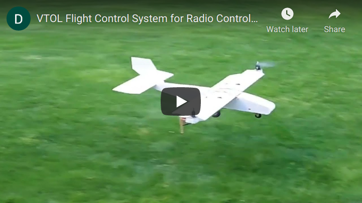

# About

An Arduino-based flight control system that uses a gyroscope and feedback loop to stabilize the aircraft in vertical flight. I have abandoned this project in favor of a new aircraft design that should be more robust and controllable.

